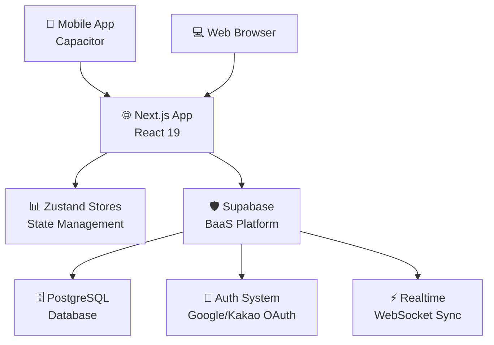
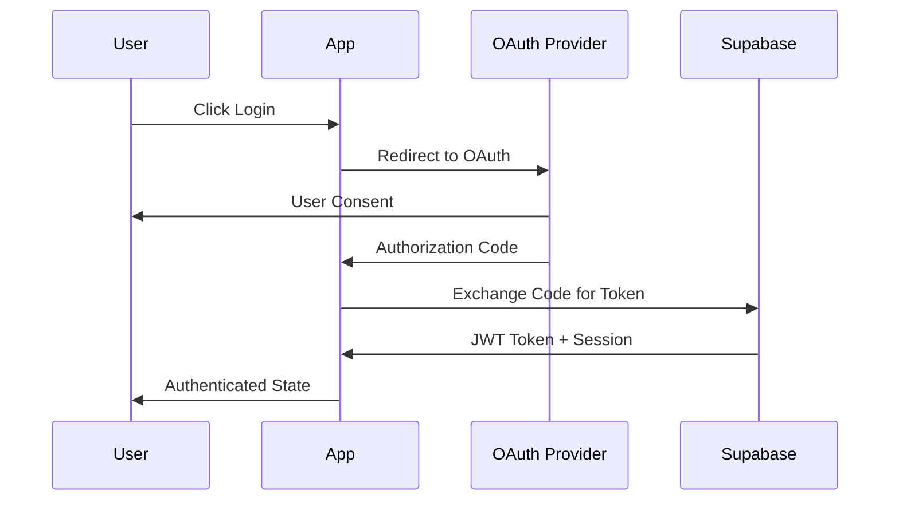

# 🏗️ DayStep Architecture Documentation

## Overview

DayStep는 Next.js 15, React 19, TypeScript를 기반으로 하는 하이브리드 웹/모바일 애플리케이션입니다. Supabase를 Backend-as-a-Service로 사용하여 인증, 데이터베이스, 실시간 동기화를 제공합니다.

## 🎯 High-Level Architecture



## 📁 Project Structure

### Core Directories

```
DayStep/
├── 📱 app/                    # Next.js App Router
│   ├── api/                   # Server-side API routes
│   ├── auth/                  # Authentication pages
│   ├── (authenticated)/       # Protected routes
│   └── context/               # React contexts
├── 🧩 components/             # Reusable UI components
│   ├── ui/                    # Base UI components (shadcn/ui)
│   ├── timeline/              # Timeline-specific components
│   ├── todos/                 # Todo-related components
│   └── layout/                # Layout components
├── 🔧 hooks/                  # Custom React hooks
├── 📚 lib/                    # Utilities and configurations
├── 🏪 state/                  # Global state management
│   └── stores/                # Zustand store definitions
├── 🎯 services/               # Business logic services
├── 🌍 shared/                 # Shared utilities and types
├── 📱 mobile/                 # Capacitor mobile configuration
└── 📋 types/                  # TypeScript type definitions
```

## 🏗️ Architecture Layers

### 1. Presentation Layer (Components)
- **UI Components** (`components/ui/`): Reusable, styled components using shadcn/ui
- **Feature Components** (`components/timeline/`, `components/todos/`): Business logic components
- **Layout Components** (`components/layout/`): App structure and navigation

### 2. State Management Layer (Zustand Stores)
- **Todo Store** (`state/stores/todoStore.ts`): Todo items, optimistic updates
- **Timeline View Store** (`state/stores/timelineViewStore.ts`): Timeline state, date navigation
- **Auth Store** (`state/stores/authStore.ts`): Authentication state
- **Settings Store** (`state/stores/settingsStore.ts`): User preferences

### 3. Business Logic Layer (Services)
- **Todo Service** (`services/todo/`): Todo operations, CRUD logic
- **User Service** (`services/user/`): User management operations
- **Sync Service** (`services/background-sync.service.ts`): Background data synchronization

### 4. Data Access Layer (Supabase)
- **Database**: PostgreSQL with Row Level Security (RLS)
- **Authentication**: OAuth integration (Google, Kakao)
- **Realtime**: WebSocket-based live updates

## 🔄 Data Flow Architecture

### Request Flow
```
1. User Interaction → 2. Component → 3. Custom Hook → 4. Zustand Store → 5. Service Layer → 6. Supabase API → 7. PostgreSQL
```

### Response Flow
```
1. PostgreSQL → 2. Supabase API → 3. Service Layer → 4. Zustand Store → 5. Component Re-render
```

### Optimistic Updates
```
1. User Action → 2. Optimistic UI Update → 3. Background API Call → 4. Success/Rollback
```

## 🛡️ Security Architecture

### Row Level Security (RLS)
- **Policy-Based Access**: Each table has RLS policies that filter data by `user_id`
- **Automatic Filtering**: Database-level security ensures users only see their data
- **No Client-Side Filtering**: Security enforced at database level, not in frontend

### Authentication Flow


## ⚡ Performance Architecture

### Code Splitting Strategy
- **Route-based**: Automatic splitting via Next.js App Router
- **Component-based**: Dynamic imports for heavy components
- **Lazy Loading**: `React.lazy()` for non-critical components

### Caching Strategy
```typescript
// 3-Tier Caching Architecture
1. Memory Cache (Zustand Store) - Immediate access
2. Browser Cache (localStorage) - Persistence across sessions
3. CDN Cache (Vercel) - Global distribution
```

### Bundle Optimization
- **Tree Shaking**: Dead code elimination
- **Minification**: Code compression
- **Gzip Compression**: Server-level compression
- **Image Optimization**: Next.js Image component with WebP

## 📱 Mobile Architecture (Capacitor)

### Hybrid App Structure
```
📱 iOS/Android Native Container
  └── 🌐 WebView (capacitor://localhost)
    └── ⚛️ Next.js App
      └── 📊 Same Components & Logic as Web
```

### Platform-Specific Features
- **Native OAuth**: Google Sign-In iOS SDK
- **Push Notifications**: Native notification system
- **File System**: Native file access capabilities
- **Camera**: Native camera integration

## 🔌 Integration Points

### External Services
- **Supabase**: Primary backend service
- **Google OAuth**: Authentication provider
- **Kakao OAuth**: Alternative authentication (Korea)
- **Vercel**: Web hosting and deployment
- **App Store Connect**: iOS app distribution
- **Google Play Console**: Android app distribution

### Internal Integrations
- **State Persistence**: Zustand + localStorage
- **Error Boundary**: React error catching
- **Toast System**: User notifications
- **Theme System**: Dark/light mode support

## 🔄 Deployment Architecture

### Web Deployment (Vercel)
```
GitHub → Vercel Build → Global CDN → Users
```

### Mobile Deployment
```
Code → Capacitor Build → Native Build → App Store/Google Play → Users
```

### Environment Management
- **Development**: Local development server
- **Staging**: Vercel preview deployments
- **Production**: Vercel production + mobile app stores

## 📊 Monitoring & Observability

### Performance Monitoring
- **Core Web Vitals**: LCP, FID, CLS tracking
- **Bundle Analysis**: Size and performance metrics
- **Error Tracking**: React error boundaries
- **User Analytics**: Performance and usage metrics

### Development Tools
- **TypeScript**: Static type checking
- **ESLint**: Code quality and consistency
- **Prettier**: Code formatting
- **Jest**: Unit testing framework
- **Playwright**: E2E testing

## 🚀 Scalability Considerations

### Current Scale
- **Users**: Designed for individual/personal use
- **Data**: Optimized for personal productivity data
- **Performance**: Sub-3s load times, <100ms interactions

### Future Scale Planning
- **Horizontal Scaling**: Supabase handles database scaling
- **CDN Distribution**: Global content delivery via Vercel
- **Component Architecture**: Modular design allows feature addition
- **State Management**: Zustand supports complex state requirements

## 🔧 Development Workflow

### Git Strategy
- **Main Branch**: Production-ready code
- **Feature Branches**: Individual feature development
- **Pull Requests**: Code review and quality control

### Testing Strategy
- **Unit Tests**: Component and function testing
- **Integration Tests**: Feature workflow testing  
- **E2E Tests**: Full user journey testing
- **Manual Testing**: Cross-platform validation

### Release Process
```
Development → Testing → Staging → Production (Web) → Mobile Build → App Store Review → Release
```

---

This architecture supports the current personal productivity use case while maintaining flexibility for future enhancements and scaling needs.