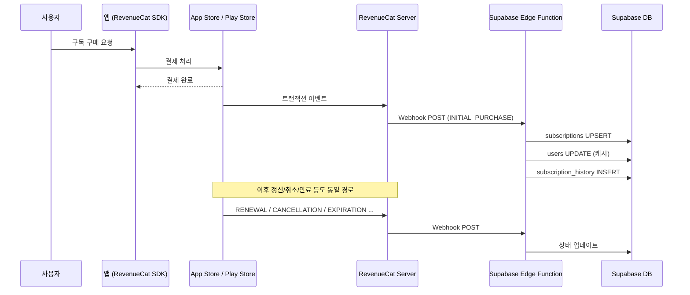
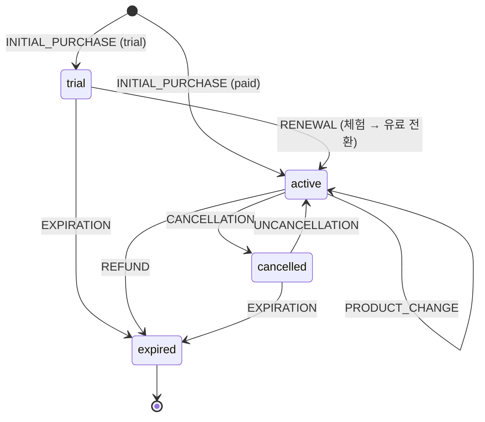

# 구독 라이프사이클

DayStep의 구독 시스템 전체 흐름을 설명한다. RevenueCat을 중개자로, Supabase를 Source of Truth로 사용한다.

---

## 1. 개요

### 구성 요소

| 구성 요소 | 역할 |
|-----------|------|
| **App Store / Play Store** | 실제 결제 처리, 구독 갱신/만료 관리 |
| **RevenueCat SDK** | 앱 내 구매 UI, 구독 상태 조회, 트랜잭션 관리 |
| **RevenueCat Server** | 스토어 이벤트 수신 → Webhook으로 서버에 전달 |
| **Supabase Edge Function** | Webhook 수신 → DB 업데이트 (`revenue-cat-webhook`) |
| **Supabase DB** | 구독 상태의 **Source of Truth** (`subscriptions`, `users`, `subscription_history`) |
| **클라이언트 Store** | `subscriptionStore.ts` — DB에서 구독 상태를 조회하여 앱에 반영 |

### 핵심 원칙

- **Source of Truth는 Supabase DB**다. RevenueCat SDK나 App Store가 아니다.
- 모든 구독 상태 변경은 **Webhook → Edge Function → DB** 경로를 통해 반영된다.
- Product ID는 `_dev`, `_prod` 접미사를 정규화하여 저장한다 (`pro_monthly_dev` → `pro_monthly`).

---

## 2. 전체 흐름



### Webhook 인증

RevenueCat → Edge Function 호출 시 `Authorization: Bearer <REVENUE_CAT_WEBHOOK_SECRET>` 헤더로 검증한다.

---

## 3. 이벤트별 상세

### 이벤트 목록 및 DB 변경

| 이벤트 | 설명 | `subscriptions` 변경 | `users` 변경 | `subscription_history` |
|--------|------|---------------------|-------------|----------------------|
| **INITIAL_PURCHASE** | 첫 구매 (체험 포함) | UPSERT: `status`=active/trial, `product_id`, 날짜들, `auto_renew_enabled`=true | `has_active_subscription`=true, `subscription_type`, `subscription_expires_at` | trial_started 또는 subscription_started |
| **RENEWAL** | 자동 갱신 성공 | `status`=active, `subscription_end_date` 갱신, `auto_renew_enabled`=true | `has_active_subscription`=true, `subscription_expires_at` 갱신 | subscription_renewed |
| **CANCELLATION** | 자동 갱신 취소 | `status`=cancelled, `cancelled_at` 기록, `auto_renew_enabled`=false | 변경 없음 (만료일까지 활성 유지) | subscription_cancelled |
| **EXPIRATION** | 구독 만료 | `status`=expired | `has_active_subscription`=false, `subscription_type`=free, `subscription_expires_at`=null | subscription_expired / trial_expired |
| **PRODUCT_CHANGE** | 상품 변경 (월→년 등) | `product_id` 변경, `subscription_end_date` 갱신 | `subscription_type` 변경, `subscription_expires_at` 갱신 | product_changed |
| **BILLING_ISSUE** | 결제 실패 | 변경 없음 (상태 유지) | 변경 없음 | billing_issue |
| **REFUND** | 환불 | `status`=expired (즉시) | `has_active_subscription`=false, `subscription_type`=free | refund_issued |
| **UNCANCELLATION** | 취소 철회 (자동 갱신 재활성화) | `status`=active, `cancelled_at`=null, `auto_renew_enabled`=true | `has_active_subscription`=true, `subscription_type`, `subscription_expires_at` | subscription_reactivated |

### 상태 전이 다이어그램



### 주요 동작 상세

**CANCELLATION → EXPIRATION 흐름**:
- 취소 시 즉시 비활성화하지 **않는다**. `status`=cancelled이지만 `subscription_end_date`까지 서비스를 제공한다.
- 만료일에 EXPIRATION 이벤트가 발생하면 그때 `users.has_active_subscription`=false로 전환된다.
- 클라이언트 `subscriptionStore.ts`에서도 cancelled + 만료일 미도래 시 활성으로 판단한다.

**방어 로직 (`ensureSubscriptionExists`)**:
- RENEWAL, CANCELLATION 등의 이벤트 처리 시, INITIAL_PURCHASE가 누락된 경우를 대비하여 subscription 레코드가 없으면 자동 생성한다.

---

## 4. DB 스키마

### `subscriptions` 테이블

| 컬럼 | 타입 | 설명 |
|------|------|------|
| `id` | uuid | PK |
| `user_id` | uuid | FK → users.id |
| `status` | text | `trial`, `active`, `cancelled`, `expired` |
| `platform` | text | `ios`, `android`, `web` |
| `product_id` | text | 상품 ID (예: `pro_monthly_dev`) |
| `revenue_cat_subscriber_id` | text | RevenueCat 구독자 ID (= user_id) |
| `revenue_cat_original_transaction_id` | text | 원본 트랜잭션 ID |
| `original_purchase_date` | timestamptz | 최초 구매일 |
| `trial_start_date` | timestamptz | 체험 시작일 |
| `trial_end_date` | timestamptz | 체험 종료일 |
| `subscription_start_date` | timestamptz | 유료 구독 시작일 |
| `subscription_end_date` | timestamptz | 구독 만료 예정일 |
| `cancelled_at` | timestamptz | 취소 시각 |
| `auto_renew_enabled` | boolean | 자동 갱신 여부 |
| `updated_at` | timestamptz | 마지막 업데이트 |

### `users` 테이블 (구독 관련 컬럼)

| 컬럼 | 타입 | 설명 |
|------|------|------|
| `has_active_subscription` | boolean | 활성 구독 여부 (캐시) |
| `subscription_type` | text | 정규화된 상품 ID (`pro_monthly`, `free` 등) |
| `subscription_expires_at` | timestamptz | 만료 예정일 |

### `subscription_history` 테이블

| 컬럼 | 타입 | 설명 |
|------|------|------|
| `id` | uuid | PK |
| `subscription_id` | uuid | FK → subscriptions.id |
| `user_id` | uuid | FK → users.id |
| `event_type` | text | 이벤트 종류 (위 테이블 참조) |
| `event_timestamp` | timestamptz | 이벤트 발생 시각 |
| `platform` | text | `ios`, `android`, `web` |
| `product_id` | text | 상품 ID |
| `revenue_cat_event_id` | text | RevenueCat 이벤트 ID |
| `revenue_cat_transaction_id` | text | RevenueCat 트랜잭션 ID |
| `metadata` | jsonb | RevenueCat 원본 이벤트 전체 |

---

## 5. 인프라 설정

### RevenueCat Webhook 설정

1. RevenueCat 대시보드 → Project → **Integrations** → **Webhooks**
2. Webhook URL: `https://<SUPABASE_PROJECT_REF>.supabase.co/functions/v1/revenue-cat-webhook`
3. Authorization Header: `Bearer <REVENUE_CAT_WEBHOOK_SECRET>`

### Supabase Secrets

```bash
# Edge Function에 필요한 환경 변수 (이미 기본 제공됨)
# SUPABASE_URL
# SUPABASE_SERVICE_ROLE_KEY

# 추가 설정 필요
supabase secrets set REVENUE_CAT_WEBHOOK_SECRET=<your-secret>
```

### Edge Function 배포

```bash
npx supabase functions deploy revenue-cat-webhook --project-ref <PROJECT_REF> --no-verify-jwt
```

> `--no-verify-jwt`: RevenueCat Webhook은 Supabase JWT가 아닌 자체 Bearer 토큰으로 인증하므로 JWT 검증을 비활성화한다.

### 플랫폼 매핑

| RevenueCat `store` | DB `platform` |
|---------------------|---------------|
| `APP_STORE` | `ios` |
| `PLAY_STORE` | `android` |
| `STRIPE` | `web` |

---

## 6. 관련 코드

| 파일 | 설명 |
|------|------|
| `apps/web/supabase/functions/revenue-cat-webhook/index.ts` | Webhook 핸들러 (이벤트 라우팅 + DB 업데이트) |
| `apps/mobile-rn/src/stores/subscriptionStore.ts` | RN 클라이언트 구독 상태 관리 |
| `apps/web/src/stores/subscriptionStore.ts` | 웹 클라이언트 구독 상태 관리 |

---

## 7. 관련 문서

- [구독 테스트 가이드](./SUBSCRIPTION_TESTING_GUIDE.md) — 플랫폼별 구독 테스트, 초기화, 트러블슈팅
- [앱 철학](./APP_PHILOSOPHY.md) — DayStep 전체 설계 철학
