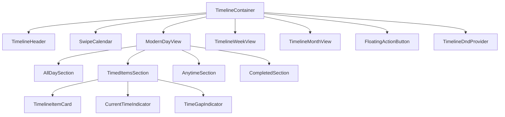

# 📅 Timeline Components Documentation

## Overview

The timeline system is the core feature of DayStep, providing a visual calendar interface for managing tasks and events. This document covers all timeline-related components and their APIs.

## 🏗️ Component Architecture



## 📦 Core Components

### `TimelineContainer`

The main container component that orchestrates the entire timeline interface.

#### **Props**
```typescript
interface TimelineContainerProps {
  className?: string;
}
```

#### **Features**
- **View Management**: Handles switching between daily, weekly, and monthly views
- **Data Orchestration**: Coordinates data loading from all stores
- **Gesture Support**: Integrates swipe gestures for navigation
- **Authentication**: Handles authentication state and loading
- **Optimistic Updates**: Displays pending operations and retry logic
- **Auto-scroll**: Automatically scrolls to current time on today's view

#### **Usage**
```typescript
import TimelineContainer from '@/components/timeline/TimelineContainer';

const HomePage = () => {
  return (
    <div className="h-screen">
      <TimelineContainer className="w-full" />
    </div>
  );
};
```

#### **Key Integration Points**
- **Stores**: Connects to `todoStore`, `timelineViewStore`, `repositoryStore`
- **Auth**: Uses `AuthContext` for authentication state
- **Gestures**: Implements `useSwipeGesture` for navigation
- **Real-time**: Handles pull-to-refresh and sync status

---

### `ModernDayView`

Displays a detailed daily timeline view with time slots and sections.

#### **Props**
```typescript
interface ModernDayViewProps {
  className?: string;
}
```

#### **Features**
- **Time Slots**: 24-hour timeline with hourly divisions
- **Sectioned Layout**: Organized into AllDay, Timed, Anytime, and Completed sections
- **Drag & Drop**: Supports reordering items within and between sections
- **Gap Detection**: Shows time gaps between scheduled items
- **Collapsible Sections**: Users can collapse/expand different sections
- **Current Time Indicator**: Visual marker showing current time

#### **Section Architecture**
```typescript
// Section organization
const sections = [
  'AllDay',      // Full-day events and tasks
  'Timed',       // Time-specific scheduled items
  'Anytime',     // Flexible timing tasks
  'Completed'    // Finished items
];
```

#### **Usage**
```typescript
import ModernDayView from '@/components/timeline/ModernDayView';

const DailyTimeline = () => {
  return (
    <div className="timeline-container">
      <ModernDayView />
    </div>
  );
};
```

---

### `TimelineHeader`

Navigation header with date controls and view mode switching.

#### **Props**
```typescript
interface TimelineHeaderProps {
  className?: string;
}
```

#### **Features**
- **Date Navigation**: Previous/next date controls
- **View Mode Toggle**: Switch between daily, weekly, monthly views
- **Current Date Display**: Shows selected date with formatting
- **Today Button**: Quick navigation to current date
- **Responsive Design**: Adapts to mobile and desktop layouts

#### **Usage**
```typescript
import TimelineHeader from '@/components/timeline/TimelineHeader';

const TimelineView = () => {
  return (
    <div>
      <TimelineHeader />
      {/* Timeline content */}
    </div>
  );
};
```

---

### `SwipeCalendar`

Interactive calendar widget with swipe navigation support.

#### **Props**
```typescript
interface SwipeCalendarProps {
  className?: string;
}
```

#### **Features**
- **Month Navigation**: Swipe left/right to change months
- **Date Selection**: Tap to select specific dates
- **Visual Indicators**: Shows days with scheduled items
- **Today Highlighting**: Special styling for current date
- **Responsive Grid**: Adapts to different screen sizes

#### **Usage**
```typescript
import SwipeCalendar from '@/components/timeline/SwipeCalendar';

const CalendarView = () => {
  return (
    <div className="calendar-section">
      <SwipeCalendar />
    </div>
  );
};
```

---

## 📋 Section Components

### `AllDaySection`

Displays events and tasks that span entire days.

#### **Props**
```typescript
interface AllDaySectionProps {
  className?: string;
  isCollapsed?: boolean;
  onToggleCollapse?: () => void;
}
```

#### **Features**
- **Full-width Display**: Items displayed as wide cards
- **Color Coding**: Border colors based on item type/category
- **Collapsible**: Can be collapsed to save space
- **Drag Drop Support**: Items can be dragged to other sections
- **Type Indicators**: Visual badges showing item type (todo, repository, etc.)

#### **Item Types**
- **All-day Todos**: Tasks without specific time requirements
- **Repository Items**: Templates and recurring task patterns

---

### `TimedItemsSection`

Main timeline showing hourly time slots with scheduled items.

#### **Props**
```typescript
interface TimedItemsSectionProps {
  className?: string;
  showTimeGaps?: boolean;
  show24HourFormat?: boolean;
}
```

#### **Features**
- **Hourly Grid**: 24-hour timeline with hour divisions
- **Time Labels**: Left sidebar showing hour labels (12/24 hour format)
- **Scheduled Items**: Items positioned by start/end time
- **Time Gap Indicators**: Shows gaps between scheduled items
- **Current Time Line**: Visual indicator of current time
- **Drag & Drop**: Items can be repositioned in time
- **Duration Display**: Visual representation of item duration

#### **Time Slot Calculation**
```typescript
// Each hour = 96px height
const HOUR_HEIGHT = 96;
const timeSlotPosition = (hour: number, minute: number) => 
  hour * HOUR_HEIGHT + (minute / 60) * HOUR_HEIGHT;
```

---

### `AnytimeSection`

Shows flexible tasks without specific time constraints.

#### **Props**
```typescript
interface AnytimeSectionProps {
  className?: string;
  isCollapsed?: boolean;
  onToggleCollapse?: () => void;
  maxDisplayItems?: number;
}
```

#### **Features**
- **Flexible Layout**: Grid or list display based on content
- **Priority Sorting**: Items ordered by priority and due date
- **Quick Actions**: Inline editing and completion
- **Batch Operations**: Multi-select for bulk actions
- **Overflow Handling**: "Show more" for many items

---

### `CompletedSection`

Displays completed tasks and achievements.

#### **Props**
```typescript
interface CompletedSectionProps {
  className?: string;
  isCollapsed?: boolean;
  onToggleCollapse?: () => void;
  showStats?: boolean;
}
```

#### **Features**
- **Achievement Display**: Visual celebration of completed items
- **Undo Functionality**: Ability to mark items as incomplete
- **Statistics**: Daily/weekly completion metrics
- **Strikethrough Styling**: Clear visual indication of completion
- **Auto-collapse**: Automatically collapses when empty

---

## 🎯 Interactive Components

### `TimelineItemCard`

Individual item card component used throughout the timeline.

#### **Props**
```typescript
interface TimelineItemCardProps {
  item: TimelineItem;
  draggable?: boolean;
  onClick?: (item: TimelineItem) => void;
  onEdit?: (item: TimelineItem) => void;
  onComplete?: (item: TimelineItem) => void;
  onDelete?: (item: TimelineItem) => void;
  className?: string;
  showTime?: boolean;
  showDuration?: boolean;
  compact?: boolean;
}

interface TimelineItem {
  id: string;
  title: string;
  description?: string;
  startTime?: Date;
  endTime?: Date;
  isCompleted: boolean;
  isAllDay: boolean;
  color?: string;
  type: 'todo' | 'repository' | 'timeline-task';
  priority?: 'low' | 'medium' | 'high';
  tags?: string[];
}
```

#### **Features**
- **Adaptive Display**: Changes appearance based on section context
- **Interactive**: Hover states, click handlers, drag handles
- **Status Indicators**: Progress bars, checkboxes, priority badges
- **Contextual Actions**: Inline edit, complete, delete actions
- **Accessibility**: Keyboard navigation and screen reader support

#### **Usage**
```typescript
import TimelineItemCard from '@/components/timeline/TimelineItemCard';

const TimelineSection = ({ items }) => {
  return (
    <div>
      {items.map(item => (
        <TimelineItemCard
          key={item.id}
          item={item}
          draggable
          showTime
          onClick={handleItemClick}
          onEdit={handleItemEdit}
          onComplete={handleItemComplete}
        />
      ))}
    </div>
  );
};
```

---

### `FloatingActionButton`

Quick action button for creating new timeline items.

#### **Props**
```typescript
interface FloatingActionButtonProps {
  className?: string;
  position?: 'bottom-right' | 'bottom-left' | 'bottom-center';
  size?: 'sm' | 'md' | 'lg';
  actions?: FABAction[];
}

interface FABAction {
  id: string;
  label: string;
  icon: ReactNode;
  onClick: () => void;
  color?: string;
}
```

#### **Features**
- **Expandable Menu**: Multiple quick actions in a radial menu
- **Context Aware**: Actions change based on current view/section
- **Gesture Support**: Supports both tap and drag interactions
- **Customizable**: Configurable position, size, and actions
- **Animated**: Smooth open/close animations

#### **Default Actions**
```typescript
const defaultActions = [
  { id: 'todo', label: 'Add Todo', icon: <Plus />, onClick: addTodo },
  { id: 'template', label: 'From Template', icon: <Copy />, onClick: addFromTemplate }
];
```

---

## ⚡ Utility Components

### `CurrentTimeIndicator`

Shows the current time as a line across the timeline.

#### **Props**
```typescript
interface CurrentTimeIndicatorProps {
  className?: string;
  show?: boolean;
  color?: string;
  animate?: boolean;
}
```

#### **Features**
- **Real-time Updates**: Updates every minute
- **Visual Line**: Horizontal line across timeline
- **Time Label**: Shows current time next to line
- **Animation**: Smooth movement as time changes
- **Conditional Display**: Only shows on today's view

---

### `TimeGapIndicator`

Shows empty time periods between scheduled items.

#### **Props**
```typescript
interface TimeGapIndicatorProps {
  startTime: Date;
  endTime: Date;
  onFillGap?: (startTime: Date, endTime: Date) => void;
  className?: string;
  minGapMinutes?: number;
}
```

#### **Features**
- **Gap Detection**: Automatically identifies time gaps
- **Interactive**: Click to fill gap with new item
- **Configurable**: Minimum gap threshold
- **Visual Styling**: Subtle background to indicate availability
- **Smart Display**: Hides very small gaps

---

## 🎨 Drag & Drop System

### `TimelineDndProvider`

Provides drag and drop context for timeline items.

#### **Props**
```typescript
interface TimelineDndProviderProps {
  children: ReactNode;
  onDragEnd?: (result: DragEndResult) => void;
  disabled?: boolean;
}
```

#### **Features**
- **Cross-section Dragging**: Items can move between sections
- **Time-based Positioning**: Items snap to time slots when dropped
- **Visual Feedback**: Drag previews and drop indicators
- **Touch Support**: Works with touch devices
- **Undo Support**: Drag operations can be undone

#### **Usage**
```typescript
import { TimelineDndProvider } from '@/components/timeline/TimelineDndProvider';

const TimelineApp = () => {
  const handleDragEnd = (result) => {
    // Handle item reordering
    updateItemPosition(result);
  };

  return (
    <TimelineDndProvider onDragEnd={handleDragEnd}>
      <TimelineContainer />
    </TimelineDndProvider>
  );
};
```

---

## 📱 Responsive Behavior

### Breakpoint Adaptations

#### **Mobile (< 768px)**
- **Single Column**: Sections stack vertically
- **Touch Optimized**: Larger touch targets, swipe gestures
- **Simplified UI**: Reduced information density
- **Collapsible**: More sections collapsed by default

#### **Tablet (768px - 1024px)**
- **Two Column**: Side-by-side layout for some sections
- **Hybrid Interactions**: Both touch and mouse support
- **Medium Density**: Balanced information display

#### **Desktop (> 1024px)**
- **Multi-column**: Full width utilization
- **Mouse Optimized**: Hover states, right-click menus
- **High Density**: Maximum information display
- **Keyboard Shortcuts**: Full keyboard navigation support

### Performance Optimizations

#### **Virtual Scrolling**
```typescript
// Large timeline views use virtual scrolling
const VirtualizedTimeline = () => {
  const { visibleItems } = useVirtualScrolling({
    items: timelineItems,
    itemHeight: 60,
    containerHeight: viewportHeight
  });
  
  return <VirtualScrollContainer items={visibleItems} />;
};
```

#### **Lazy Loading**
```typescript
// Sections are loaded on-demand
const LazyTimelineSection = lazy(() => 
  import('@/components/timeline/TimedItemsSection')
);
```

#### **Memoization**
```typescript
// Expensive calculations are memoized
const MemoizedTimelineItem = memo(TimelineItemCard, (prev, next) => {
  return prev.item.id === next.item.id && 
         prev.item.updatedAt === next.item.updatedAt;
});
```

---

## 🛠️ Development Guidelines

### Creating Timeline Components

#### **Component Template**
```typescript
import React, { memo } from 'react';
import { cn } from '@/lib/utils';

interface MyTimelineComponentProps {
  className?: string;
  // Define specific props
}

const MyTimelineComponent = memo<MyTimelineComponentProps>(({
  className,
  // Destructure props
}) => {
  return (
    <div className={cn('default-classes', className)}>
      {/* Component content */}
    </div>
  );
});

MyTimelineComponent.displayName = 'MyTimelineComponent';

export default MyTimelineComponent;
```

#### **Best Practices**
1. **Use memo()**: Wrap components in `React.memo` for performance
2. **Consistent Naming**: Follow the `Timeline*` naming convention
3. **TypeScript**: Always define prop interfaces
4. **Class Names**: Use `cn()` utility for conditional classes
5. **Accessibility**: Include proper ARIA labels and roles
6. **Error Boundaries**: Wrap components in error boundaries
7. **Testing**: Write unit tests for component logic

#### **Integration Checklist**
- [ ] Component exported from timeline index
- [ ] Props interface documented
- [ ] Responsive behavior implemented
- [ ] Accessibility features added
- [ ] Unit tests written
- [ ] Storybook story created (if applicable)
- [ ] Performance optimized

---

This documentation provides comprehensive coverage of all timeline components, their APIs, and integration patterns used in the DayStep application.